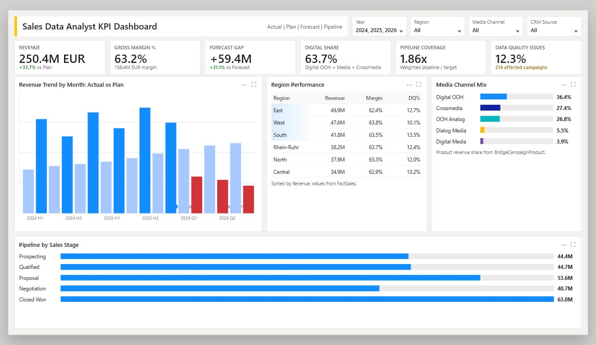

# Sales KPI Analysis - Power BI Portfolio Project



## Project Overview

This project is a realistic **Sales Data Analyst / Power BI portfolio project** inspired by a public job posting for a **Sales Data Analyst role at Ströer Media Deutschland GmbH**.

It simulates a media sales business scenario with campaign sales, CRM pipeline, planning, forecast, targets and media channel performance.

The goal is to show the full analytics workflow:

- raw and cleaned CSV data
- Python data preparation
- SQL analysis questions
- Power BI semantic model
- DAX KPI measures
- dashboard screenshot
- business insights for interview discussion

## Business Questions

- Which regions generate the most revenue?
- How does actual revenue perform against plan and forecast?
- Which media channels drive digital sales growth?
- How healthy is the sales pipeline?
- Where are data quality issues affecting CRM and sales reporting?
- Which KPIs should management use for commercial steering?

## Main KPIs

- Revenue
- Delivery Cost
- Gross Margin
- Gross Margin %
- Actual vs Plan %
- Actual vs Forecast %
- Target Attainment %
- Pipeline Coverage
- Win Rate %
- Digital Revenue Share %
- Inventory Utilization %
- CPM
- Data Quality Issue %

## Repository Structure

```text
sales-kpi-analysis/
|-- README.md
|-- data/
|   |-- raw/
|   |   |-- sales_data_raw.csv
|   |   |-- FactSales.csv
|   |   |-- FactPipeline.csv
|   |   |-- FactPlan.csv
|   |   |-- FactForecast.csv
|   |   |-- FactTargets.csv
|   |   |-- BridgeCampaignProduct.csv
|   |   |-- DimDate.csv
|   |   |-- DimCustomer.csv
|   |   |-- DimProduct.csv
|   |   |-- DimRegion.csv
|   |   `-- DimSalesRep.csv
|   `-- cleaned/
|       |-- sales_data_cleaned.csv
|       |-- FactSales.csv
|       |-- FactPipeline.csv
|       |-- FactPlan.csv
|       |-- FactForecast.csv
|       |-- FactTargets.csv
|       |-- BridgeCampaignProduct.csv
|       |-- DimDate.csv
|       |-- DimCustomer.csv
|       |-- DimProduct.csv
|       |-- DimRegion.csv
|       `-- DimSalesRep.csv
|-- scripts/
|   |-- clean_sales_data.py
|   `-- generate_stroeer_sales_data.py
|-- sql/
|   `-- sales_analysis_queries.sql
|-- powerbi/
|   |-- sales_dashboard.pbix
|   `-- screenshots/
|       `-- dashboard_mockup.png
|-- dax/
|   `-- measures.md
|-- insights/
|   `-- business_insights.md
`-- docs/
    |-- data_dictionary.md
    `-- project_workflow.md
```

## Power BI File

Open:

```text
powerbi/sales_dashboard.pbix
```

The Power BI model uses a star schema with:

- `FactSales`
- `FactPipeline`
- `FactPlan`
- `FactForecast`
- `FactTargets`
- `BridgeCampaignProduct`
- `DimDate`
- `DimCustomer`
- `DimProduct`
- `DimRegion`
- `DimSalesRep`

## How to Reproduce the Data

Run:

```bash
python scripts/clean_sales_data.py
```

This regenerates the synthetic sales dataset and creates:

- `data/raw/sales_data_raw.csv`
- `data/cleaned/sales_data_cleaned.csv`

The detailed star-schema CSVs are also kept in `data/raw` and `data/cleaned` for Power BI modeling.

## Dashboard Preview

The dashboard focuses on executive sales performance:

- KPI cards
- Actual vs Plan trend
- Region performance
- Media channel mix
- Pipeline by sales stage


## Data Privacy

All data is synthetic and created for portfolio and interview purposes. No real customer, company or personal data is included.

This is an independent portfolio project and is **not affiliated with, endorsed by or based on internal data from Ströer Media Deutschland GmbH**.
